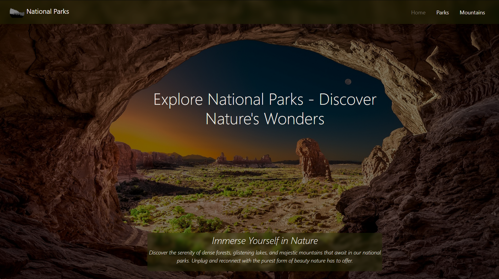

# Capstone 2: Enjoy the Outdoors

#### Description: 

In this project I utilized my knowledge of HTML, CSS, JavaScript, and Boostrap to create a website that's all about embracing the beauty of the outdoors.  It's designed to guide users in discovering amazing national parks to explore and exhilarating mountains to conquer. The National Parks Search Page, crafted through problem-solving and research skills, ensures streamlined user access to park information.


## Home Page

The home page has a simple, responsive design with a navbar linking to the other pages

<p align="center" width="100%">
     
</p>


## National Parks Search Page

The National Parks search page provides a simple user interface with two search options that allow users to find the park perfect for them.

<p align="center" width="100%">
     
</p>


### Responsive Design

Both the Home Page and National Park Search Page are responsive through the use of Bootstrap 5

<p align="center" width="100%">
     
     
</p>

### Interesting Code

The search page has a CSS animation that displays to notify the user to scroll. It was challenging but quite fun to get operational. I also added a dynamic reset when the user selects an option in one dropdown it clears the selection of the other, with this I was able to display them both.

**CSS**
```
.scroll-down {
    animation: pop-up 4s linear 6 forwards;
}

@keyframes pop-up {
    0% {
        opacity: 0.9;
        bottom: 10%;
    }
    25% {
        opacity: 0.3;
        bottom: 5%;
    }
    50% {
        opacity: 0.9;
        bottom: 10%;
    }
    75% {
        opacity: 0.3;
        bottom: 5%;
    }
    100% {
        opacity: 0.9;
        bottom: 10%;
    }
}
```

<video src="images/search-page-scroll.mp4" controls title="Title"></video>